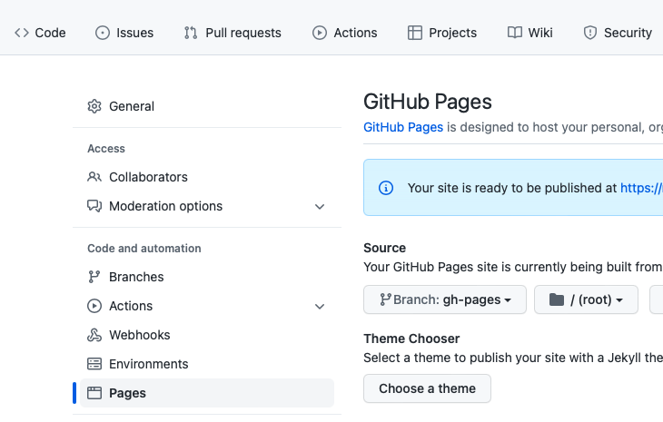
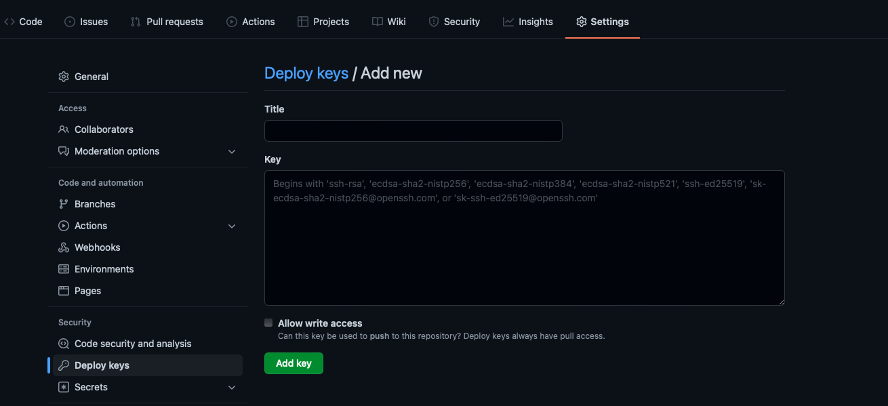
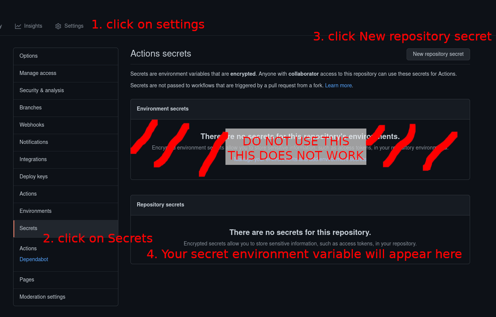

## Gerar Github pages com actions

- Baseado no artigo [Deploy React App using GitHub Actions](https://dev.to/achukka/deploy-react-app-using-github-actions-157d)

- Primeiro de tudo adicionar no arquivo `package.json` o seguinte:

```json
"homepage": "https://<githubusername>.github.io/<app>"
```

- Alterar o `<githubusername>` pelo seu usuário do github e o `<app>` pelo nome do repositório

- Adicionar uma branch chamada `gh_pages` e nas configurações do repositório na parte de Page adiciona-lo:



- No projeto criar o arquivo `.github/workflows/NOME_DO_SEU_WORKFLOW.yml` no meu caso criei o arquivo `../../.github/workflows/custom_player_storybook.yml` só acessá-lo e verificar o conteúdo!

- Gere uma ssh key com esse comando:

```shell
ssh-keygen -t rsa -b 4096 -C "$(git config user.email)" -f "<your-deploy-branch>" -N ""
```

- Será gerado dois arquivos na pasta, lembre de não envia-los par

- `<your-deploy-branch>.pub`
- `<your-deploy-branch>` (private key)

- Adicione o valor da .pub no deploy keys do github:




- O valor da private key adicionar nas envs:
- Para tal veja essa instrução:

[How to access secrets when using flutter web with github actions](https://stackoverflow.com/questions/67964110/how-to-access-secrets-when-using-flutter-web-with-github-actions/67998780#67998780)



- Ajustar no arquivo: `../../.github/workflows/custom_player_storybook.yml`:

```yml
jobs:
  build:
    runs-on: ubuntu-latest
    strategy:
      matrix:
        node-version: [14.x]
    steps:
    # MORE ...
    # MORE ...
    # MORE ...
    # MORE ...
    # MORE ...
    - name: Deploy 🚀
      uses: peaceiris/actions-gh-pages@v3
      with:
        deploy_key: ${{ secrets.ACTIONS_DEPLOY_KEY }} # NOME CONFORME ADICIONADO NAS ENVS
        publish_dir: ./build
```

- Realizar o commit normalmente e deve ser executado a action!

- Dessa forma será possível acessar a page!
