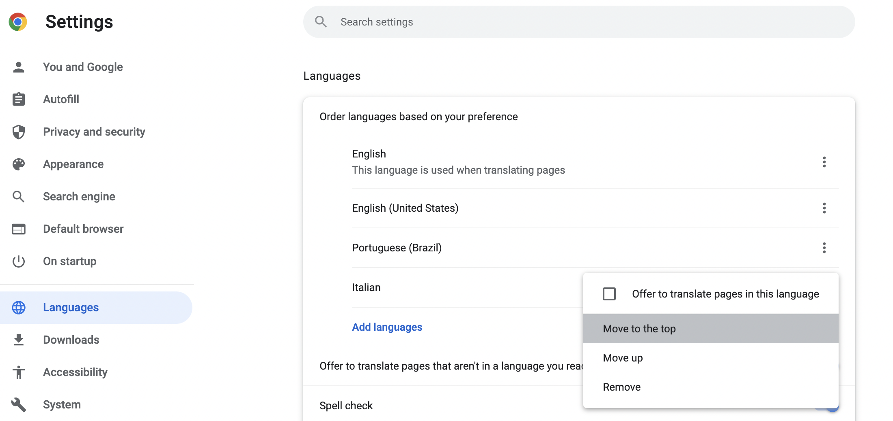

# Translation


- Referencias:
  - [How to localize your Next.js application with next-translate](https://mariestarck.com/how-to-localize-your-next-js-application-with-next-translate/)
  - [Step-by-step: How to Internationalize your NextJS App with Next-Translate](https://blog.flycode.com/step-by-step-how-to-internationalize-your-nextjs-app-with-next-translate)

---

- Para adicionar a parte de tradução no nextjs podemos adicionar a seguinte dependencia:

```shell
yarn add next-translate
```

- Após isso é necessário realizar algumas configurações:

  - Criar o arquivo `i18n.json` na raiz do projeto

```json
{
  "locales": ["it", "es"],
  "defaultLocale": "es",
  "pages": {
    "*": ["common", "home"]
  }
}
```

  - Defina os locales que deseja cobrir
  - `pages` podemos definir alguns valores para segmentar melhor os arquivos de tradução que será explicado mais adiante

  - É necessário ajustar o arquivo na raiz `./next.config.js`:

```js
/* eslint-disable @typescript-eslint/no-var-requires */
/** @type {import('next').NextConfig} */
const nextTranslate = require("next-translate");

const myConfig = {
  reactStrictMode: true,
};

module.exports = nextTranslate({
  ...myConfig,
});

```

  - Caso tenha alguma configuração adicional só adicionar ali onde tem a variavel `myConfig`, ou caso não tenha nada ficaria assim:

```js
/* eslint-disable @typescript-eslint/no-var-requires */
/** @type {import('next').NextConfig} */
const nextTranslate = require("next-translate");


module.exports = nextTranslate();
```

  - Na raiz do projeto criar a pasta `locales/` dentro desta pasta criar outras pastas que terá o mesmo nome ou valor definido no array `locales` do arquivo `i18n.json`
  - Ou seja caso no arquivo mencionado tenha os seguite:

```json
{
  "locales": ["it", "es"]
  // MORE...
}
```

  - Será necessário criar as pastas `./locales/it` e `./locales/es`
  - Dentro de cada uma dessas pastas criamos os arquivos `.json` sendo o nome do arquivo conforme definido no array dentro do objeto `pages` no arquivo `i18n.json`
  - Ou seja caso no arquivo mencionado tenha o seguinte:

```json
{
  // MORE
  "pages": {
    "*": ["common", "home"]
  }
}
```

  - Será necessário criar os arquivos `common.json` e `home.json` dentro de cada uma das pastas dentro de `./locales/`
  - No nosso exemplo temos o seguinte:

```json
{
  "locales": ["it", "es"],
  "defaultLocale": "es",
  "pages": {
    "*": ["common", "home"]
  }
}
```

  - Dessa forma vamos criar os arquivos `./locales/it/common.json`, `./locales/it/home.json`, e `./locales/es/common.json`, `./locales/es/home.json`,

- O conteúdo de cada um dos arquivos deverá ser identico, no caso das chaves, mudando apenas os valores:

```json
// locales/it/common.json
{
  "title": "Ciao mondo"
}
```

```json
// locales/es/common.json
{
  "title": "Hola Mundo"
}
```

- Agora basta no nosso component ou page ou hook utilizar da seguinte forma:

```tsx
// ... MORE ...
import useTranslation from "next-translate/useTranslation";


const Home: NextPage = ({ toggles }: any) => {
  const { t } = useTranslation("common");
  const { t: th } = useTranslation("home"); // é possível subdividir em outros arquivos!!!
  return (
    <>
      Translation: {t("title")}
      Translation: {th("title")}
    </>
  );
};

export default Home;

```

- Para testar basta acessar no chrome a rota: chrome://settings/languages
- e adicionar o idioma que deseja testar!



---

## Utilizando Middleware para internationalized Routing

- Referencia:
  - [Internationalized Routing](https://nextjs.org/docs/advanced-features/i18n-routing)

- Caso utilize `server.js` é necessário que nesse arquivo seja informado o hostname e a port:

```js
const port = parseInt(process.env.PORT, 10) || 3001;
const dev = process.env.NODE_ENV !== "production";
const hostname = "localhost";
const app = next({ dev, hostname, port });
```


- Por fim criar um middleware `src/pages/_middleware.ts`