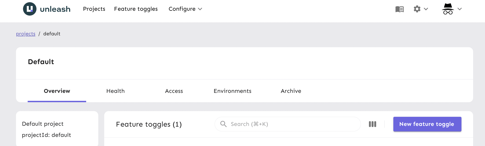
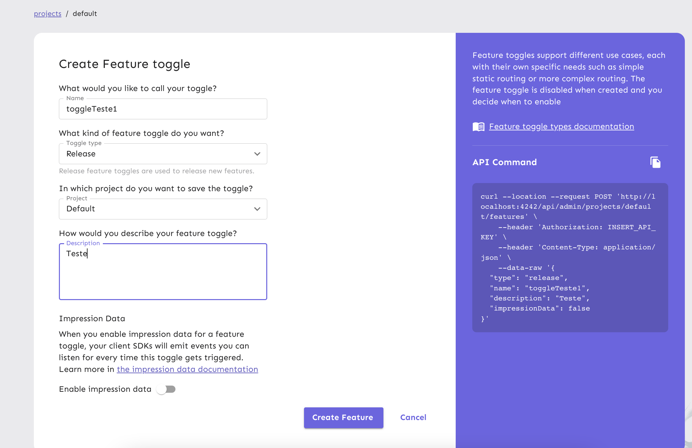
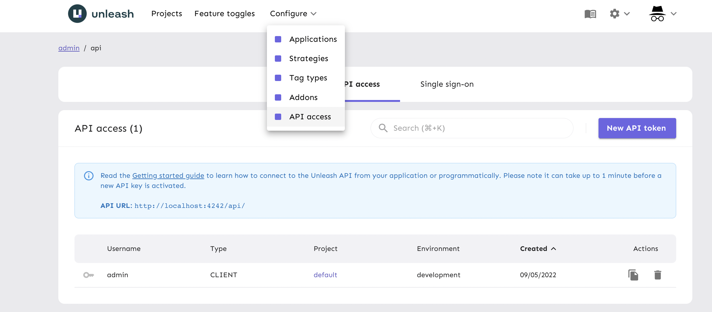

# Unleash

- Para controlar a lançamentos de novos recursos é possivel utilizar o unleash para habilitar/desabilitar alguns recursos que a aplicação deva ter!
https://www.getunleash.io/

---

## Gratuitamente

- Para rodar de forma gratuita uma forma é utilizar o docker, ou algum servidor conforme indicado em: https://github.com/Unleash/unleash


---

## Criar toggle

- Após seguir os passos para instalação conforme link destacado acima para criar um toggle é muito simples,

- Após acessar o dashboard clicar em `New feature toggle`




- Aparecerá uma tela como essa:



- Muito cuidado com o campo do nome, pois ele será utilizado para identificar o seu toggle


---

### API token

- Para obter o token acessar no menu `Configure > API access` escolher ou criar uma nova API token, depois na lista escolher o item adequado e clicar em copiar, depois é só copia-lo para o arquivo `./server.js` no lugar adequado.




## Utilizar com o NextJS

- Para utilizar com o nextJS precisamos instalar a seguinte dependencia:

```shell
yarn add next-unleash unleash-client
```

- E seguir os passos conforme: https://github.com/Unleash/next-unleash

- Basicamente é necessário criar um arquivo `./server.js`
- Mais informações aqui: https://nextjs.org/docs/advanced-features/custom-server

- No arquivo `package.json` realizar esses ajustes:

```json
"scripts": {
  "dev": "node server.js",
  "build": "next build",
  "start": "NODE_ENV=production node server.js"
}
```

- No arquivo `src/pages/_app.tsx` será necessário adicionar algumas coisas: 

```tsx
import "../styles/globals.scss";

import type { AppProps } from "next/app";
import Head from "next/head";
import { withUnleashProvider } from "next-unleash"; // <-- AQUI

function MyApp({ Component, pageProps }: AppProps) {
  return (
    <>
      <Head>
        <meta
          name="viewport"
          content="width=device-width, initial-scale=1.0, maximum-scale=1.0, user-scalable=0"
        />
      </Head>
      <Component {...pageProps} />
    </>
  );
}

export default withUnleashProvider(MyApp); // <-- AQUI
```

- A dependencia `next-unleash` não possuí tipagem há várias formas de resolver isso, uma delas é no arquivo `tsconfig.json` adicionar o seguinte:

```json
"noImplicitAny": false,
```

- Essa dependencia utiliza o modelo [HOC](https://reactjs.org/docs/higher-order-components.html)
- para utiliza-lo em um component apenas fazer o seguinte:

```tsx
import type { NextPage } from "next";
import { withUnleash } from "next-unleash"; // <-- AQUI

const Home: NextPage = ({ toggles /* <- AQUI */ }: any) => (
  <>
    // ... MORE
    {console.log("toggles.toggleTeste1", toggles.toggleTeste1) /* <- AQUI */ }
  </>
);

export default withUnleash(Home); /* <- AQUI */

```